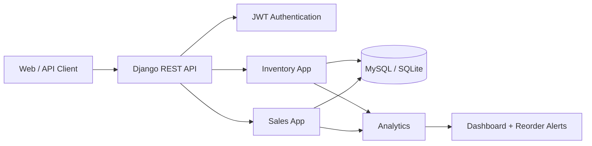
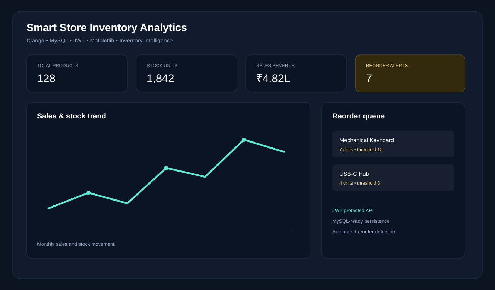
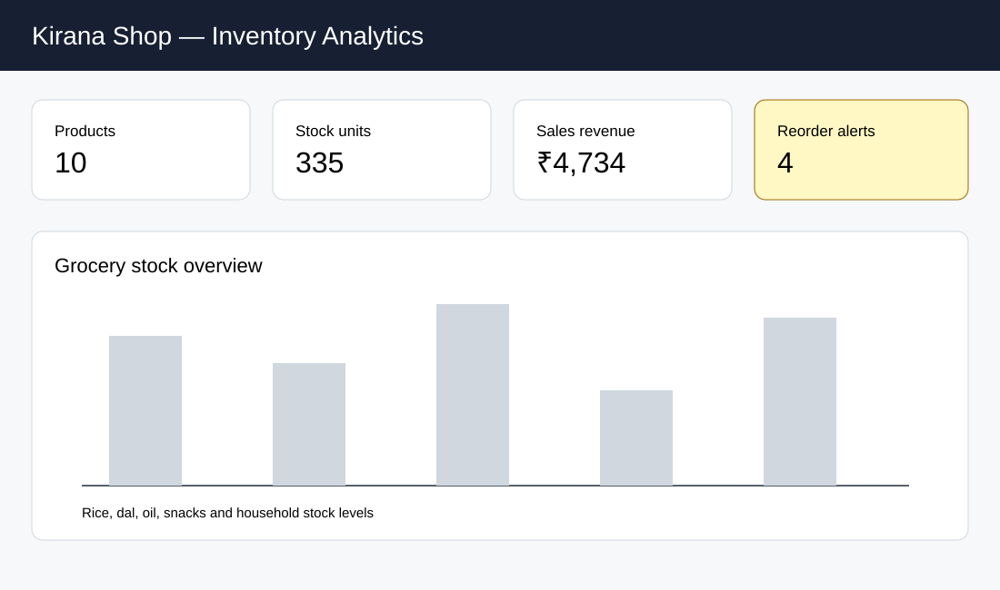
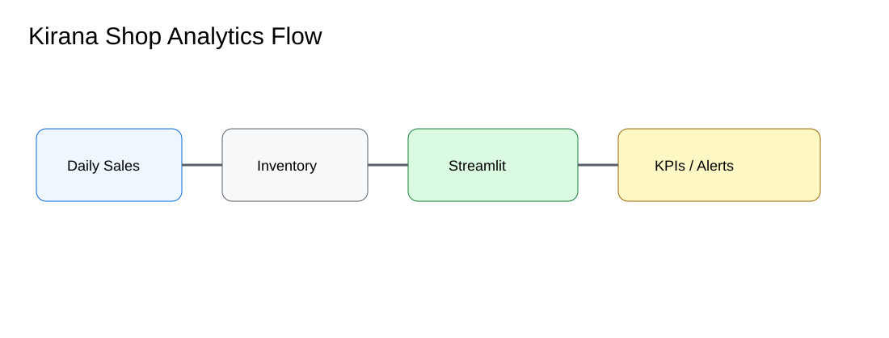

# Smart Store Inventory Analytics

A Django-based inventory and sales analytics application with **MySQL-ready configuration**, **JWT authentication**, stock dashboards, sales summaries, and reorder alerts.

## Features
- Product and inventory management.
- Sales transaction recording.
- JWT authentication endpoints.
- Stock-level and reorder analytics.
- Dashboard API for business metrics.
- MySQL configuration through environment variables.
- SQLite fallback for quick local development.
- Sample fixture data.
- Automated API tests.

## Architecture


## Screenshots

### Product dashboard


### Inventory dashboard


### Analytics flow


## Quick start
```bash
python -m venv .venv
# Windows
.venv\Scripts\activate
# macOS/Linux
source .venv/bin/activate
pip install -r requirements.txt
copy .env.example .env
python manage.py migrate
python manage.py loaddata sample_data
python manage.py runserver
```

Open http://127.0.0.1:8000/

## API
- `POST /api/token/`
- `POST /api/token/refresh/`
- `GET /api/products/`
- `POST /api/products/`
- `POST /api/sales/`
- `GET /api/analytics/summary/`

## Configuration
For MySQL, set:
```
DB_ENGINE=django.db.backends.mysql
DB_NAME=smart_store
DB_USER=root
DB_PASSWORD=your_password
DB_HOST=localhost
DB_PORT=3306
```

## Project structure
```text
config/
inventory/
sales/
analytics/
templates/
fixtures/
docs/screenshots/
manage.py
requirements.txt
.env.example
```

This repository is a portfolio implementation of the Smart Store project scope; local SQLite is provided so the project can be evaluated without a database server.

## Production-style support files
- `Dockerfile` and `.dockerignore` for containerized development.
- `Makefile` and `.github/workflows/ci.yml` for repeatable commands and CI.
- `docs/API.md` and `docs/database.md` for API/database setup.
- `templates/dashboard.html` provides the local dashboard landing page.
- `docs/screenshots/product-overview.svg` for the polished dashboard preview.

The visual assets are repository documentation mockups rather than screenshots of a deployed system.
