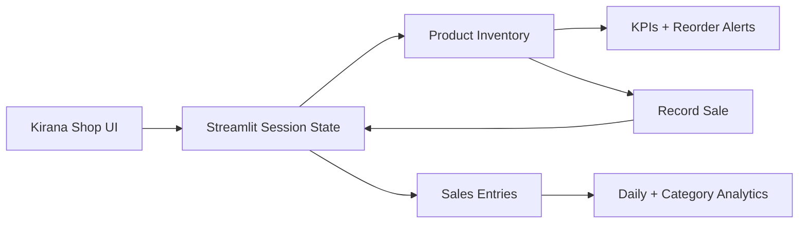

# Smart Store Inventory Analytics — Kirana Shop

A **Streamlit-first kirana shop inventory and sales analytics application** built with Python. The dashboard is designed around a small Indian grocery store and demonstrates stock tracking, daily sales, revenue analytics, and low-stock reorder alerts.

The repository also retains the original Django/REST implementation under `config/`, `inventory/`, `sales/`, and `analytics/` for backend-oriented evaluation.

## 🛒 Streamlit deployment

The Streamlit app entry point is:

```text
streamlit_app.py
```

### Run locally

```bash
python -m venv .venv

# Windows
.venv\Scripts\activate

# macOS/Linux
source .venv/bin/activate

pip install -r requirements.txt
streamlit run streamlit_app.py
```

Open the local URL shown by Streamlit, usually `http://localhost:8501`.

### Deploy on Streamlit Community Cloud

1. Open Streamlit Community Cloud and create a new app.
2. Select repository: `ankitha768/smart-store-inventory-analytics`.
3. Select branch: `main`.
4. Set the main file to: `streamlit_app.py`.
5. Deploy.

No MySQL server or environment secret is required for the Streamlit portfolio demo. The dashboard uses local session-state sample data so it can run as a self-contained Python application.

## 🏪 Kirana shop features

- 🛒 Grocery products such as rice, dal, sugar, oil, salt, atta, biscuits, milk, tea, and soap.
- ⚖️ Product units such as kg, litre, pack, and bar.
- 📦 Inventory overview with category and product search filters.
- 🚨 Low-stock reorder alerts for products below their reorder level.
- 🧾 Record-sale workflow with stock validation and automatic stock deduction.
- 📊 Daily sales revenue and category-wise revenue charts.
- 💰 Revenue, transaction, product, and stock KPIs.
- 🇮🇳 Indian grocery pricing displayed in INR (₹).
- 🐍 Python-only Streamlit deployment path.
- 🗃️ Original Django/REST implementation retained for backend reference.

## Screenshots

### Kirana shop dashboard


### Inventory dashboard


### Analytics flow


## Streamlit architecture



## Project structure

```text
streamlit_app.py
requirements.txt
.streamlit/config.toml
docs/screenshots/
config/                 # original Django configuration
inventory/              # original Django inventory app
sales/                  # original Django sales app
analytics/              # original Django analytics app
templates/
fixtures/
tests/
```

## Legacy Django/API setup

The original Django implementation is retained separately from the Streamlit deployment path.

```bash
pip install -r requirements-django.txt
python manage.py migrate
python manage.py runserver
```

The legacy API includes JWT authentication, product/sales endpoints, and an analytics summary endpoint.

## Notes

- The Streamlit demo is intentionally self-contained and does not depend on MySQL.
- Streamlit session state is temporary; data entered during a session is not a permanent database record.
- The sample catalog and prices are illustrative portfolio data, not live shop pricing.
- The repository's visual assets are documentation mockups, not screenshots of a live deployed instance.
